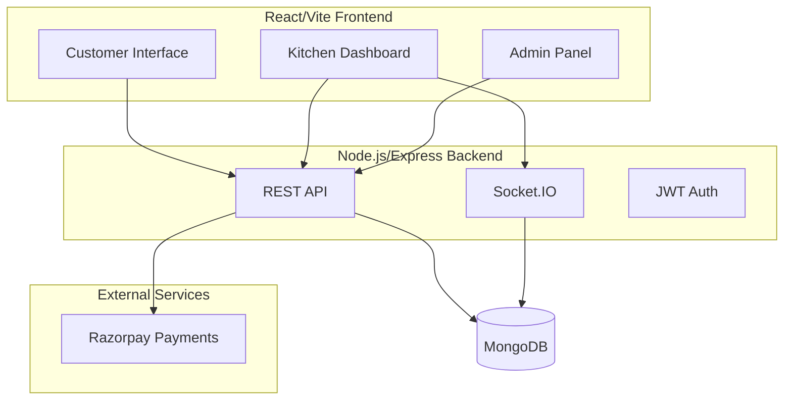

# ServeX Implementation Walkthrough

## Overview

Successfully implemented a complete **Table-Specific QR Menu Ordering & Payment System** with the following components:

## Architecture



---

## Backend Implementation

### Database Models
| Model | File | Purpose |
|-------|------|---------|
| Table | [Table.ts](file:///c:/Users/Asus/OneDrive/Desktop/ServeX/backend/src/models/Table.ts) | Table info + QR code storage |
| MenuItem | [MenuItem.ts](file:///c:/Users/Asus/OneDrive/Desktop/ServeX/backend/src/models/MenuItem.ts) | Menu items with categories, pricing |
| Order | [Order.ts](file:///c:/Users/Asus/OneDrive/Desktop/ServeX/backend/src/models/Order.ts) | Orders with items, status tracking |
| Payment | [Payment.ts](file:///c:/Users/Asus/OneDrive/Desktop/ServeX/backend/src/models/Payment.ts) | Razorpay payment records |
| User | [User.ts](file:///c:/Users/Asus/OneDrive/Desktop/ServeX/backend/src/models/User.ts) | Admin/Kitchen staff accounts |

### API Routes
- **Auth**: Login, register, user management
- **Tables**: CRUD + QR code generation
- **Menu**: CRUD with category management
- **Orders**: Create, status updates, analytics
- **Payments**: Razorpay integration + webhooks

### Key Services
- [payment.ts](file:///c:/Users/Asus/OneDrive/Desktop/ServeX/backend/src/services/payment.ts) - Razorpay order creation & verification
- [qrcode.ts](file:///c:/Users/Asus/OneDrive/Desktop/ServeX/backend/src/services/qrcode.ts) - QR code generation for tables

---

## Frontend Implementation

### Customer Flow Pages
| Page | File | Description |
|------|------|-------------|
| Table Landing | [TableLanding.tsx](file:///c:/Users/Asus/OneDrive/Desktop/ServeX/frontend/src/pages/TableLanding.tsx) | QR scan welcome page |
| Menu | [Menu.tsx](file:///c:/Users/Asus/OneDrive/Desktop/ServeX/frontend/src/pages/Menu.tsx) | Category browsing + add to cart |
| Cart | [Cart.tsx](file:///c:/Users/Asus/OneDrive/Desktop/ServeX/frontend/src/pages/Cart.tsx) | Cart management + checkout |
| Payment | [Payment.tsx](file:///c:/Users/Asus/OneDrive/Desktop/ServeX/frontend/src/pages/Payment.tsx) | Razorpay checkout |
| Order Tracking | [OrderTracking.tsx](file:///c:/Users/Asus/OneDrive/Desktop/ServeX/frontend/src/pages/OrderTracking.tsx) | Real-time status updates |

### Kitchen Dashboard
- [Dashboard.tsx](file:///c:/Users/Asus/OneDrive/Desktop/ServeX/frontend/src/pages/kitchen/Dashboard.tsx)
- Real-time order feed via Socket.IO
- Status update buttons (PAID → PREPARING → READY → SERVED)
- Audio notifications for new orders

### Admin Panel
| Feature | File |
|---------|------|
| Menu Management | [MenuManagement.tsx](file:///c:/Users/Asus/OneDrive/Desktop/ServeX/frontend/src/pages/admin/MenuManagement.tsx) |
| Table Management | [TableManagement.tsx](file:///c:/Users/Asus/OneDrive/Desktop/ServeX/frontend/src/pages/admin/TableManagement.tsx) |
| Orders | [Orders.tsx](file:///c:/Users/Asus/OneDrive/Desktop/ServeX/frontend/src/pages/admin/Orders.tsx) |
| Analytics | [Analytics.tsx](file:///c:/Users/Asus/OneDrive/Desktop/ServeX/frontend/src/pages/admin/Analytics.tsx) |

---

## Key Features Implemented

### ✅ Customer Features
- Table-specific QR code URLs (`/t/{tableId}`)
- Mobile-first responsive menu UI
- Cart with quantities and special instructions
- Price breakdown (subtotal, tax, service charge)
- Razorpay payment integration
- Real-time order status tracking

### ✅ Kitchen Features
- Live order feed with Socket.IO
- Status management workflow
- Sound notifications for new orders
- Table number and item details display

### ✅ Admin Features
- Full CRUD for menu items
- Category management
- Table creation with QR code generation
- QR code download functionality
- Order history with filters
- Revenue analytics dashboard

### ✅ Security Features
- JWT authentication
- Server-side price calculation
- Rate limiting
- Payment signature verification
- Session-based duplicate prevention

---

## Setup Instructions

### 1. Install Dependencies
```bash
# Backend
cd backend && npm install

# Frontend
cd frontend && npm install
```

### 2. Configure Environment
```bash
# Backend: Copy and edit .env
cp backend/.env.example backend/.env

# Frontend: Copy and edit .env
cp frontend/.env.example frontend/.env
```

### 3. Seed Database
```bash
cd backend && npm run seed
```

### 4. Start Development Servers
```bash
# Terminal 1: Backend
cd backend && npm run dev

# Terminal 2: Frontend
cd frontend && npm run dev
```

### 5. Access Application
- Customer: `http://localhost:5173/t/{tableId}`
- Login: `http://localhost:5173/login`
- Kitchen: `http://localhost:5173/kitchen`
- Admin: `http://localhost:5173/admin`

---

## Demo Credentials
| Role | Email | Password |
|------|-------|----------|
| Admin | admin@servex.com | admin123 |
| Kitchen | kitchen@servex.com | kitchen123 |

---

## Files Created

### Backend (25 files)
- Configuration, models, routes, middleware, services, socket handlers

### Frontend (30+ files)
- Pages, components, stores, utilities, styles

See [README.md](file:///c:/Users/Asus/OneDrive/Desktop/ServeX/README.md) for complete documentation.
